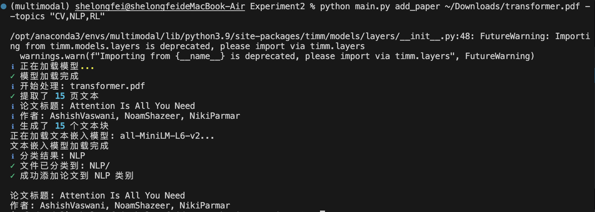
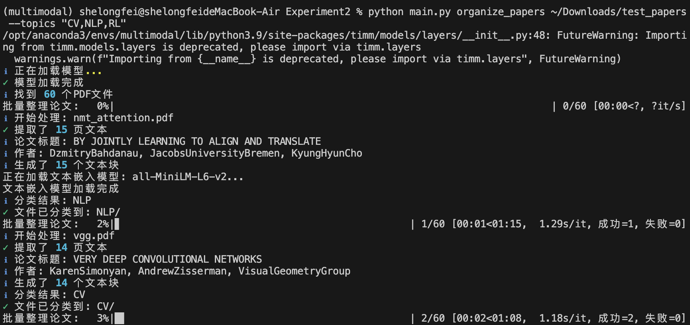
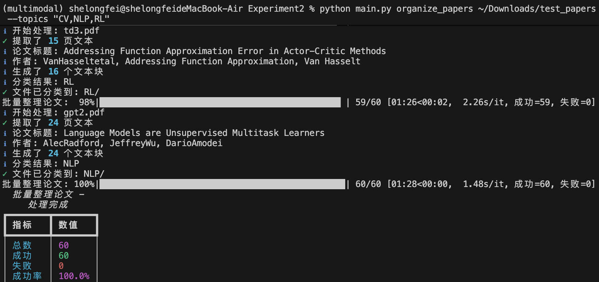
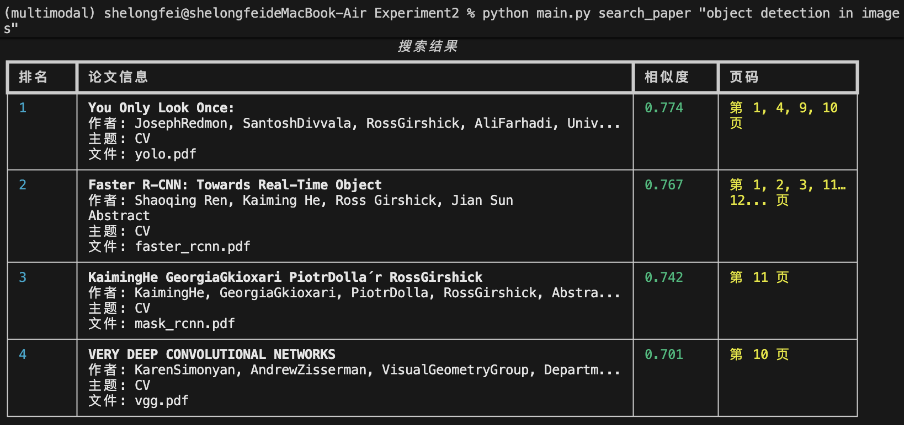
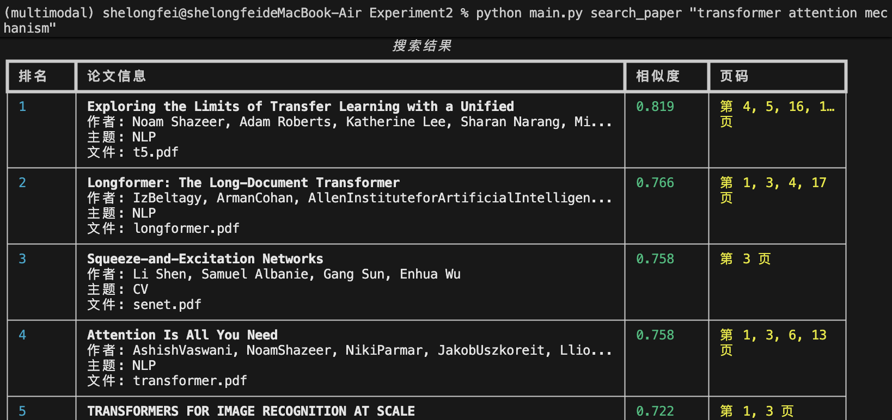
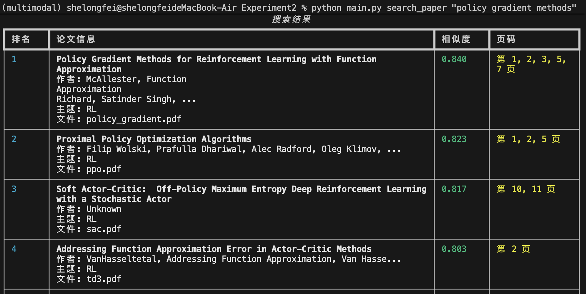
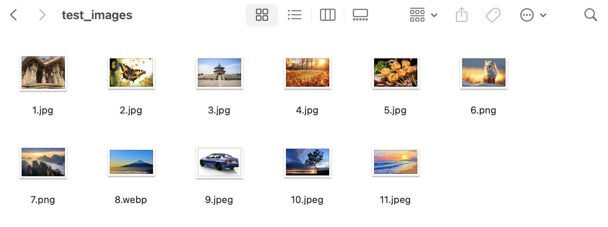
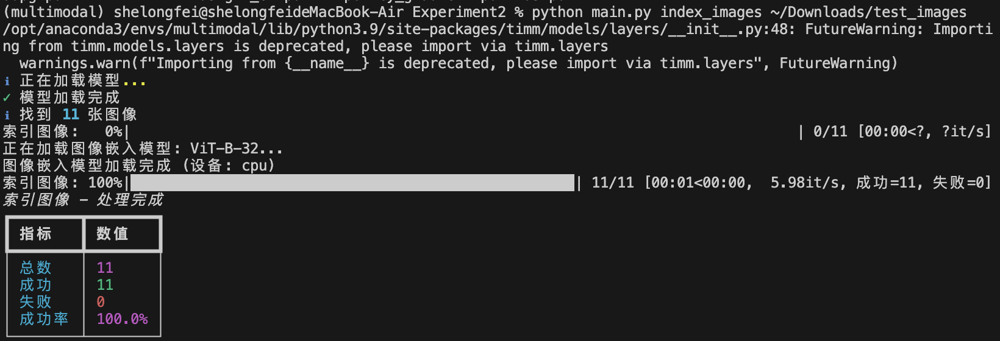
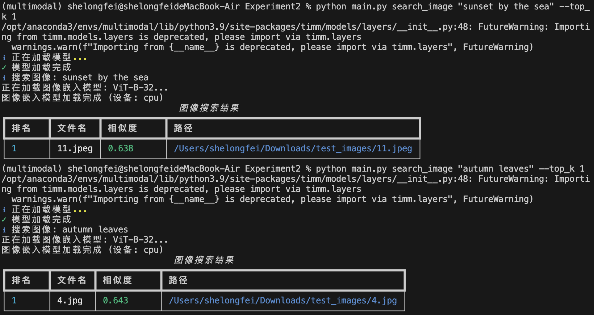

# 本地 AI 智能文献与图像管理助手

基于多模态神经网络的本地文献和图像语义检索系统。支持自然语言搜索论文、自动分类归档、以文搜图等功能。

## 功能特性

### 文献管理
- **语义搜索**: 使用自然语言查询论文内容，返回相关文献和具体页码
- **自动分类**: 根据内容自动识别主题（CV/NLP/RL等），归档到对应文件夹
- **批量整理**: 一键整理混乱的论文库，自动扫描和分类所有PDF

### 图像管理
- **以文搜图**: 通过自然语言描述查找本地图像库中的匹配图片
- **向量索引**: 基于CLIP模型的图文多模态匹配

## 技术栈

- **文本嵌入**: SentenceTransformers (all-MiniLM-L6-v2)
- **图像嵌入**: CLIP (ViT-B-32)
- **向量数据库**: ChromaDB
- **PDF处理**: PyMuPDF
- **UI**: Rich (命令行美化)

## 安装

```bash
# 克隆项目
git clone https://github.com/longfei-aa/Local-Multimodal-AI-Agent.git

# 安装依赖
pip install -r requirements.txt
```

## 使用方法

### 添加单篇论文
```bash
python main.py add_paper paper.pdf --topics "CV,NLP,RL"
```

### 语义搜索论文
```bash
python main.py search_paper "transformer attention mechanism" --top_k 5
python main.py search_paper "image classification with deep neural networks"
python main.py search_paper "deep Q-learning for Atari games"
```

### 批量整理论文
```bash
python main.py organize_papers ~/Downloads/papers --topics "CV,NLP,RL"
```

### 图像索引
```bash
python main.py index_images ~/Pictures
```

### 以文搜图
```bash
python main.py search_image "sunset by the sea" --top_k 5
python main.py search_image "mountain landscape"
```

### 查看统计
```bash
python main.py stats
```

## 测试流程

### 1. 准备测试数据

项目提供60篇经典论文的下载脚本（CV、NLP、RL各20篇）:

```bash
# 运行下载脚本
./download_test_papers.sh
```

论文将下载到 `~/Downloads/test_papers/`，所有文件混合存放用于测试自动分类功能。

### 2. 功能测试

**添加单篇论文并自动分类**

```bash
python main.py add_paper ~/Downloads/transformer.pdf --topics "CV,NLP,RL"
# 预期: 自动识别为 NLP 主题并移动到 data/papers/NLP/
```



**批量整理测试**

```python
python main.py organize_papers ~/Downloads/test_papers --topics "CV,NLP,RL"
# 预期: 自动将60篇论文分类到对应主题文件夹
```





**语义搜索测试**

```bash
# CV 相关
python main.py search_paper "object detection in images"

# NLP 相关
python main.py search_paper "transformer attention mechanism"

# RL 相关
python main.py search_paper "policy gradient methods"
```







**验证结果**

```bash
ls data/papers/CV/      # 应包含约20篇CV论文
ls data/papers/NLP/     # 应包含约20篇NLP论文
ls data/papers/RL/      # 应包含约20篇RL论文
```


总体准确率：98.33% (59/60，gan被误分)

### 3. 图像测试

```bash
# 索引图像
python main.py index_images ~/Downloads/test_images
```





```bash
# 搜索图像
python main.py search_image "sunset by the sea" --top_k 1
python main.py search_image "autumn leaves" --top_k 1
```




## 目录结构

```
Experiment2/
├── main.py                    # 主入口
├── config/
│   └── settings.py            # 配置文件
├── models/
│   ├── text_embedder.py       # 文本嵌入
│   └── image_embedder.py      # 图像嵌入
├── services/
│   ├── vector_store.py        # 向量数据库
│   ├── paper_manager.py       # 论文管理
│   └── image_manager.py       # 图像管理
├── utils/
│   └── progress.py            # 日志和进度条
└── data/
    ├── papers/                # 论文存储（自动分类）
    │   ├── CV/
    │   ├── NLP/
    │   └── RL/
    └── vector_db/             # ChromaDB数据库
```

## 环境要求

- Python 3.8+
- 内存 8GB+
- 操作系统: Windows / macOS / Linux